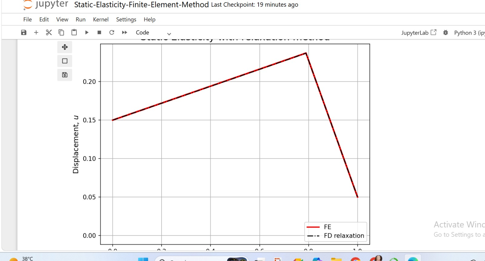

# Static Elasticity using the Finite Element Method (FEM)

## Overview

This project demonstrates the numerical solution of the one-dimensional static elasticity problem using the **Finite Element Method (FEM)** and compares it with the **Finite Difference Relaxation Method**.

The implementation follows the concepts of the Poisson equation for static elasticity and illustrates how both numerical methods converge to similar displacement fields.

This project was completed while studying the Coursera course **Computers, Waves, Simulations** and further explored independently in Python.

---

## Physics Background

For static elasticity, the displacement does not change with time.

The governing equation is

-μ d²u/dx² = f

where

- μ = shear modulus
- u = displacement
- f = external force

---

## Numerical Methods

This project includes:

- Finite Element Method (FEM)
- Finite Difference Relaxation Method
- Comparison of both numerical solutions
- Iterative convergence visualization

---

## Technologies Used

- Python
- NumPy
- Matplotlib
- Jupyter Notebook

---
## Simulation

## Finite Element Solution

## Relaxation Method

## Repository Contents

- Static_Elasticity_FEM.ipynb
- requirements.txt
- images/
- README.md

---

## Learning Outcomes

After completing this project I learned:

- Fundamentals of the Finite Element Method
- Construction of the stiffness matrix
- Solving Poisson's equation numerically
- Relaxation methods
- Boundary conditions
- Scientific visualization using Matplotlib

---

## References

Computers, Waves, Simulations (Coursera)

The numerical implementation is based on educational material from the course and has been recreated for learning and portfolio purposes.
